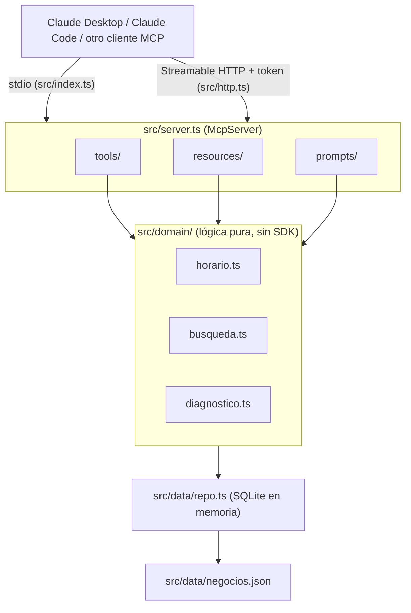

# MCP Directorio Acámbaro

[](https://github.com/atapia9/mcp-directorio-acambaro/actions/workflows/ci.yml)
[](LICENSE)
[](package.json)
[](https://github.com/atapia9/mcp-directorio-acambaro/releases)

> Servidor **Model Context Protocol** en TypeScript que permite a asistentes de IA buscar negocios locales de Acámbaro, Guanajuato, y generar un diagnóstico de presencia digital vinculado a los servicios de SDDA.

## Problema y solución

**Problema.** Un asistente de IA no puede consultar por sí solo el directorio de negocios locales de Acambaro.com.mx ni evaluar la presencia digital de un negocio.

**Solución.** Un servidor MCP que expone el directorio y un diagnóstico de presencia digital (puntaje de 0 a 100 con un servicio de SDDA sugerido) como tools, resources y prompts que cualquier cliente MCP puede usar: Claude Desktop, Claude Code o MCP Inspector.

## Arquitectura



## Documentación
| Archivo | De qué trata |
|---|---|
| [`docs/00-VISION-Y-ALCANCE.md`](docs/00-VISION-Y-ALCANCE.md) | Por qué, para quién, alcance y criterios de éxito |
| [`docs/01-ARQUITECTURA.md`](docs/01-ARQUITECTURA.md) | Stack, capacidades MCP, modelo de datos, estructura |
| [`docs/02-ROADMAP.md`](docs/02-ROADMAP.md) | Fases y checklist de construcción |
| [`docs/03-DESPLIEGUE.md`](docs/03-DESPLIEGUE.md) | Despliegue en OCI A1 detrás de Cloudflare (Docker o systemd) |
| [`CLAUDE.md`](CLAUDE.md) | Instrucciones para Claude Code |

## Capacidades
- **Tools:** `buscar_negocios`, `detalle_negocio`, `negocios_abiertos`, `diagnostico_digital` (más `ping`, una tool de prueba)
- **Resources:** `directorio://categorias`, `sdda://servicios`
- **Prompts:** `recomendar_negocio`, `propuesta_sdda`
- **Transportes:** stdio (`src/index.ts`) para Claude Desktop/Code, y Streamable HTTP con token por header (`src/http.ts`) para despliegue remoto.
- **Datos:** 21 negocios ficticios en 11 categorías, servidos desde SQLite (`src/data/repo.ts`).

## Stack

TypeScript · Node.js 22.12+ · SDK oficial de MCP (`@modelcontextprotocol/sdk`) · SQLite (`better-sqlite3`) · zod · Vitest · ESLint y Prettier · Docker · GitHub Actions

## Ejemplo de uso

Salida real de la tool `diagnostico_digital` (probada con MCP Inspector y por stdio):

> **Prompt:** "¿Qué tan bien está la presencia digital de la Ferretería El Tornillo Feliz?"

```
Ferretería El Tornillo Feliz: 20/100 (nivel bajo)
  ❌ Sitio web propio (25 pts)
  ❌ WhatsApp de contacto (20 pts)
  ❌ Presencia en redes sociales (20 pts)
  ❌ Ubicación en Google Maps (15 pts)
  ✅ Teléfono de contacto (10 pts)
  ✅ Descripción con contenido suficiente (10 pts)
Servicio sugerido: Diagnóstico y arranque digital SDDA: presencia básica (perfil, WhatsApp, ubicación).
```

> GIF de demo en vivo: pendiente de grabar una vez desplegado en producción (ver [`docs/02-ROADMAP.md`](docs/02-ROADMAP.md), Fase 6).

## Instalación en 5 minutos

```bash
git clone https://github.com/atapia9/mcp-directorio-acambaro
cd mcp-directorio-acambaro
npm install
npm run build
```

**Probarlo sin ningún cliente**, con MCP Inspector:
```bash
npm run inspect
```

**Conectarlo a Claude Desktop**, agregando esto a tu `claude_desktop_config.json`
(o desde Settings → Conectores/MCP si tu versión de la app lo gestiona ahí):
```json
{
  "mcpServers": {
    "directorio-acambaro": {
      "command": "node",
      "args": ["/ruta/absoluta/a/mcp-directorio-acambaro/dist/index.js"]
    }
  }
}
```

**Modo HTTP** (para desplegarlo, ver [`docs/03-DESPLIEGUE.md`](docs/03-DESPLIEGUE.md)):
```bash
MCP_TOKEN="un-token-largo-y-aleatorio" PORT=3000 npm run start:http
```

## Estado

- **Versión publicada:** [v0.1.0](https://github.com/atapia9/mcp-directorio-acambaro/releases/tag/v0.1.0), el MVP con transporte stdio.
- **Desde entonces, sin release nuevo:** persistencia en SQLite, transporte Streamable HTTP con token, artefactos de despliegue (Docker, systemd y cloudflared) y el manifiesto `server.json` para el registro MCP. La versión v0.2.0 se etiquetará cuando el despliegue esté verificado en producción.
- **Calidad:** lint, pruebas con cobertura y build en cada push y PR a `main` (GitHub Actions).
- **Datos:** los 21 negocios de ejemplo son ficticios.
- **Despliegue remoto:** preparado y validado localmente (método Docker, dominio `mcp.acambaro.com.mx`; ver [docs/03-DESPLIEGUE.md](docs/03-DESPLIEGUE.md)), pero pendiente de ejecutarse: falta acceso a la instancia OCI y a Cloudflare. Por eso todavía no hay demo en vivo.
- **Registro MCP:** `server.json` está listo; falta publicarlo.
- **Desarrollo activo:** este servidor continúa evolucionando dentro de [aca-ai-orchestrator](https://github.com/atapia9/aca-ai-orchestrator) (`packages/mcp-directorio`), donde se agregó un importador de datos del DENUE (INEGI). Este repositorio conserva el servidor autónomo. La migración, con el historial de git preservado, está documentada en el [ADR 0002](https://github.com/atapia9/aca-ai-orchestrator/blob/main/docs/ADR/0002-migracion-mcp-directorio.md).

## Autor
**Armando Tapia** — Acambaro.com.mx · SDDA · [GitHub @atapia9](https://github.com/atapia9)

## Licencia
MIT

---

> Este material fue elaborado con asistencia de Claude (Anthropic) y revisado por Jesús Armando Tapia Gallegos.
